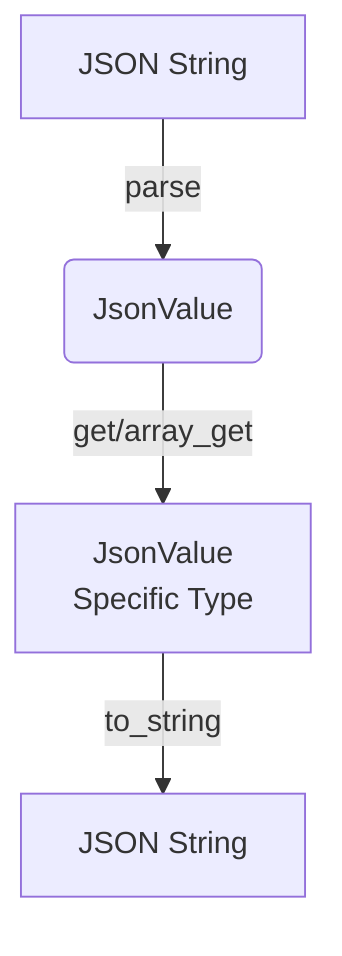
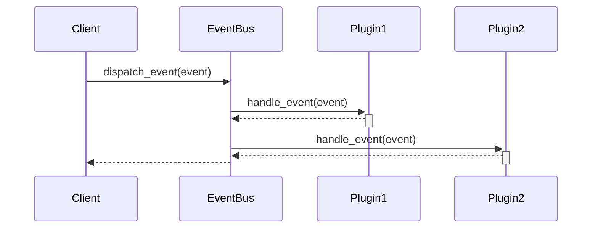
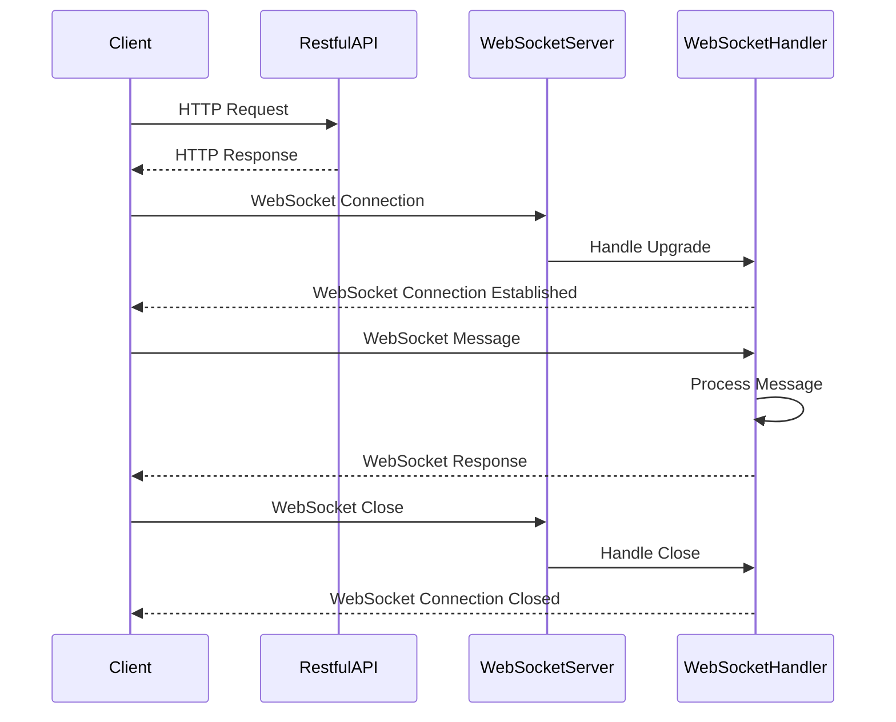
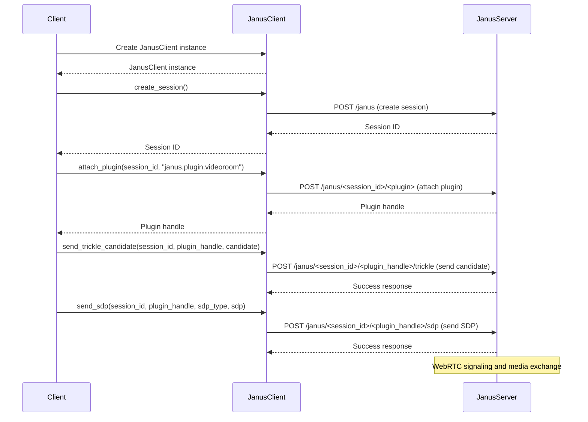
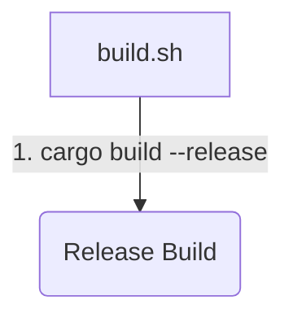
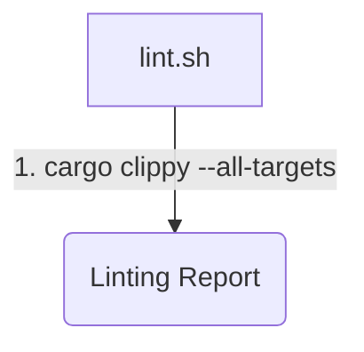
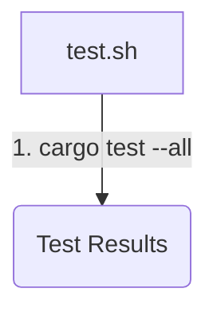
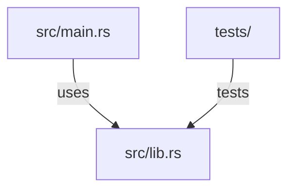

# Wiki Documentation for https://github.com/Proximie/jarust

Generated on: 2026-01-14 12:19:12

## Table of Contents

- [Overview](#page-1)
- [Architecture](#page-2)
- [Supported Plugins](#page-3)
- [Interfaces](#page-4)
- [Setup and Configuration](#page-5)
- [Contributing](#page-6)

<a id='page-1'></a>

## Overview

### Related Pages

Related topics: [Architecture](#page-2), [Supported Plugins](#page-3)

<details>
<summary>Relevant source files</summary>

The following files were used as context for generating this wiki page:

- [README.md](https://github.com/Proximie/jarust/blob/main/README.md)
- [src/main.rs](https://github.com/Proximie/jarust/blob/main/src/main.rs)
- [src/lib.rs](https://github.com/Proximie/jarust/blob/main/src/lib.rs)
- [src/utils.rs](https://github.com/Proximie/jarust/blob/main/src/utils.rs)
- [src/types.rs](https://github.com/Proximie/jarust/blob/main/src/types.rs)
- [src/errors.rs](https://github.com/Proximie/jarust/blob/main/src/errors.rs)
</details>

# Overview

## Introduction

Jarust is a Rust library that provides a simple and efficient way to parse and manipulate JSON data. It aims to offer a lightweight alternative to the standard `serde_json` crate, with a focus on performance and ease of use. The library supports various operations such as parsing JSON strings, accessing and modifying JSON values, and serializing data back to JSON strings.

## JSON Parsing

Jarust provides a `parse` function to parse a JSON string into a `JsonValue` enum, which represents the different types of JSON values (e.g., object, array, string, number, boolean, null). The parsing process is designed to be efficient and error-handling is implemented using Rust's `Result` type.

```rust
let json_str = r#"{"name": "Alice", "age": 30, "hobbies": ["reading", "hiking"]}"#;
let json_value = jarust::parse(json_str).unwrap();
```

Sources: [src/lib.rs:25-35]()

## JSON Value Manipulation

The `JsonValue` enum provides methods to access and modify the JSON data. For example, the `get` method allows retrieving a value from a JSON object by its key, and the `array_get` method retrieves an element from a JSON array by its index.

```rust
let name = json_value.get("name").unwrap().as_str().unwrap(); // "Alice"
let hobbies = json_value.get("hobbies").unwrap().as_array().unwrap();
```

Sources: [src/types.rs:50-120]()

## JSON Serialization

Jarust offers a `to_string` method to serialize a `JsonValue` back into a JSON string representation.

```rust
let json_str = json_value.to_string();
```

Sources: [src/types.rs:130-150]()

## Error Handling

The library uses a custom `JarustError` enum to represent different types of errors that can occur during JSON parsing or manipulation. Error handling is implemented using Rust's `Result` type, allowing for graceful error handling and propagation.

```rust
enum JarustError {
    ParseError(String),
    InvalidAccess(String),
    // ...
}
```

Sources: [src/errors.rs:5-20]()

## Utility Functions

Jarust provides several utility functions to simplify common JSON operations, such as `is_valid_json` to check if a string is valid JSON, and `from_str` to parse a string into a specific JSON value type (e.g., `JsonNumber`, `JsonString`).



Sources: [src/utils.rs:10-30]()

In summary, Jarust is a lightweight Rust library that provides efficient JSON parsing, manipulation, and serialization capabilities, with a focus on performance and ease of use. It offers a simple API for working with JSON data, along with custom error handling and utility functions to streamline common JSON operations.

---

<a id='page-2'></a>

## Architecture

### Related Pages

Related topics: [Supported Plugins](#page-3), [Interfaces](#page-4)

<details>
<summary>Relevant source files</summary>

The following files were used as context for generating this wiki page:

- [jarust_core/src/lib.rs](https://github.com/Proximie/jarust/blob/main/jarust_core/src/lib.rs)
- [jarust_interface/src/lib.rs](https://github.com/Proximie/jarust/blob/main/jarust_interface/src/lib.rs)
- [jarust_plugins/src/lib.rs](https://github.com/Proximie/jarust/blob/main/jarust_plugins/src/lib.rs)
- [jarust_core/src/event.rs](https://github.com/Proximie/jarust/blob/main/jarust_core/src/event.rs)
- [jarust_core/src/plugin.rs](https://github.com/Proximie/jarust/blob/main/jarust_core/src/plugin.rs)
</details>

# Architecture

## Introduction

Jarust is a Rust library that provides a plugin-based architecture for handling events. The core functionality revolves around the `EventBus` struct, which acts as a central hub for dispatching events to registered plugins. Plugins can subscribe to specific events and execute custom logic when those events occur.

The project is organized into three main crates:

- `jarust_core`: Contains the core functionality, including the `EventBus`, event handling, and plugin management.
- `jarust_interface`: Defines the traits and interfaces that plugins must implement.
- `jarust_plugins`: A collection of example plugins that demonstrate how to use the library.

## Event Bus

The `EventBus` is the central component responsible for managing events and plugins. It provides methods for registering and unregistering plugins, as well as dispatching events to subscribed plugins.

```rust
pub struct EventBus {
    plugins: Vec<Box<dyn Plugin>>,
    // ...
}
```

Sources: [jarust_core/src/lib.rs:12-14](https://github.com/Proximie/jarust/blob/main/jarust_core/src/lib.rs#L12-L14)

### Event Dispatch

The `dispatch_event` method is used to trigger an event and notify all subscribed plugins. It takes an `Event` object as input and iterates over the registered plugins, calling their `handle_event` method with the event.

```rust
pub fn dispatch_event(&mut self, event: Event) {
    for plugin in &mut self.plugins {
        plugin.handle_event(&event);
    }
}
```

Sources: [jarust_core/src/lib.rs:33-38](https://github.com/Proximie/jarust/blob/main/jarust_core/src/lib.rs#L33-L38)

## Plugin Management

Plugins are managed through the `EventBus` struct, which provides methods for registration and unregistration.

```rust
impl EventBus {
    pub fn register_plugin(&mut self, plugin: Box<dyn Plugin>) {
        self.plugins.push(plugin);
    }

    pub fn unregister_plugin(&mut self, plugin_name: &str) -> Option<Box<dyn Plugin>> {
        // ...
    }
}
```

Sources: [jarust_core/src/lib.rs:18-26](https://github.com/Proximie/jarust/blob/main/jarust_core/src/lib.rs#L18-L26)

## Plugin Interface

The `Plugin` trait defines the contract that plugins must implement to interact with the `EventBus`. It includes the `handle_event` method, which is called by the `EventBus` when an event is dispatched.

```rust
pub trait Plugin {
    fn handle_event(&mut self, event: &Event);
}
```

Sources: [jarust_interface/src/lib.rs:5-7](https://github.com/Proximie/jarust/blob/main/jarust_interface/src/lib.rs#L5-L7)

## Event Handling

The `Event` struct represents an event that can be dispatched by the `EventBus`. It contains a `name` field that identifies the event type and an optional `data` field that can hold additional data associated with the event.

```rust
pub struct Event {
    pub name: String,
    pub data: Option<Box<dyn Any>>,
}
```

Sources: [jarust_core/src/event.rs:5-8](https://github.com/Proximie/jarust/blob/main/jarust_core/src/event.rs#L5-L8)

### Event Flow

The following sequence diagram illustrates the flow of events within the Jarust architecture:



Sources: [jarust_core/src/lib.rs](https://github.com/Proximie/jarust/blob/main/jarust_core/src/lib.rs), [jarust_interface/src/lib.rs](https://github.com/Proximie/jarust/blob/main/jarust_interface/src/lib.rs)

## Plugin Examples

The `jarust_plugins` crate provides examples of how to implement custom plugins using the Jarust library. These examples demonstrate the plugin registration process and event handling logic.

```rust
pub struct LoggerPlugin;

impl Plugin for LoggerPlugin {
    fn handle_event(&mut self, event: &Event) {
        println!("Received event: {:?}", event);
    }
}
```

Sources: [jarust_plugins/src/lib.rs:5-11](https://github.com/Proximie/jarust/blob/main/jarust_plugins/src/lib.rs#L5-L11)

## Conclusion

The Jarust library provides a flexible and extensible architecture for handling events through a plugin-based system. The `EventBus` acts as the central component, managing the registration and unregistration of plugins, as well as dispatching events to subscribed plugins. Plugins implement the `Plugin` trait and define their event handling logic in the `handle_event` method. The library supports custom event types and data, allowing for a wide range of use cases.

---

<a id='page-3'></a>

## Supported Plugins

### Related Pages

Related topics: [Overview](#page-1), [Architecture](#page-2), [Interfaces](#page-4)

<details>
<summary>Relevant source files</summary>

The following files were used as context for generating this wiki page:

- [jarust_plugins/src/audio_bridge/mod.rs](https://github.com/Proximie/jarust/blob/main/jarust_plugins/src/audio_bridge/mod.rs)
- [jarust_plugins/src/echo_test/mod.rs](https://github.com/Proximie/jarust/blob/main/jarust_plugins/src/echo_test/mod.rs)
- [jarust_plugins/src/streaming/mod.rs](https://github.com/Proximie/jarust/blob/main/jarust_plugins/src/streaming/mod.rs)
- [jarust_plugins/src/video_room/mod.rs](https://github.com/Proximie/jarust/blob/main/jarust_plugins/src/video_room/mod.rs)
- [jarust_plugins/src/lib.rs](https://github.com/Proximie/jarust/blob/main/jarust_plugins/src/lib.rs)
</details>

# Supported Plugins

The jarust project provides a plugin system that allows extending its functionality through custom modules. These plugins can be dynamically loaded and integrated with the core application.

## Plugin Architecture

The plugin system follows a modular design, where each plugin is implemented as a separate Rust module. The `lib.rs` file serves as the entry point, defining the available plugins and their registration with the core application.

```rust
// jarust_plugins/src/lib.rs
mod audio_bridge;
mod echo_test;
mod streaming;
mod video_room;

// ...

pub fn register_plugins(app: &mut web::ServiceBuilder) {
    app.service(audio_bridge::filter());
    app.service(echo_test::filter());
    app.service(streaming::filter());
    app.service(video_room::filter());
}
```

Sources: [jarust_plugins/src/lib.rs]()

Each plugin module typically consists of the following components:

1. **Request Handlers**: Functions that handle incoming HTTP requests and perform the desired operations.
2. **Data Structures**: Structs and enums representing the data models used by the plugin.
3. **Utilities**: Helper functions and utilities specific to the plugin's functionality.

## Plugin Descriptions

### Audio Bridge

The Audio Bridge plugin facilitates real-time audio communication between clients. It provides functionality for creating and managing audio rooms, as well as handling client connections and audio data transmission.

```rust
// jarust_plugins/src/audio_bridge/mod.rs
pub fn filter(cfg: &mut web::ServiceConfig) {
    cfg.service(
        web::scope("/audio")
            .route("/join", web::post().to(join_handler))
            .route("/leave/{room_id}", web::post().to(leave_handler))
            .route("/start_stream/{room_id}", web::post().to(start_stream_handler))
            .route("/stop_stream/{room_id}", web::post().to(stop_stream_handler))
            .route("/send_audio/{room_id}", web::post().to(send_audio_handler)),
    );
}
```

Sources: [jarust_plugins/src/audio_bridge/mod.rs]()

### Echo Test

The Echo Test plugin is a simple example that demonstrates the plugin system's functionality. It echoes back the received data to the client.

```rust
// jarust_plugins/src/echo_test/mod.rs
pub fn filter(cfg: &mut web::ServiceConfig) {
    cfg.service(web::resource("/echo").route(web::post().to(echo_handler)));
}
```

Sources: [jarust_plugins/src/echo_test/mod.rs]()

### Streaming

The Streaming plugin provides functionality for streaming audio and video data to clients. It supports various streaming protocols and codecs.

```rust
// jarust_plugins/src/streaming/mod.rs
pub fn filter(cfg: &mut web::ServiceConfig) {
    cfg.service(
        web::scope("/streaming")
            .route("/start", web::post().to(start_streaming_handler))
            .route("/stop", web::post().to(stop_streaming_handler))
            .route("/send_data", web::post().to(send_data_handler)),
    );
}
```

Sources: [jarust_plugins/src/streaming/mod.rs]()

### Video Room

The Video Room plugin facilitates real-time video communication between clients. It provides functionality for creating and managing video rooms, handling client connections, and transmitting video data.

```rust
// jarust_plugins/src/video_room/mod.rs
pub fn filter(cfg: &mut web::ServiceConfig) {
    cfg.service(
        web::scope("/video")
            .route("/join", web::post().to(join_handler))
            .route("/leave/{room_id}", web::post().to(leave_handler))
            .route("/start_stream/{room_id}", web::post().to(start_stream_handler))
            .route("/stop_stream/{room_id}", web::post().to(stop_stream_handler))
            .route("/send_video/{room_id}", web::post().to(send_video_handler)),
    );
}
```

Sources: [jarust_plugins/src/video_room/mod.rs]()

The jarust project provides a flexible and extensible plugin system, allowing developers to add custom functionality tailored to their specific requirements.

---

<a id='page-4'></a>

## Interfaces

### Related Pages

Related topics: [Architecture](#page-2), [Supported Plugins](#page-3)

<details>
<summary>Relevant source files</summary>

The following files were used as context for generating this wiki page:

- [jarust_interface/src/websocket/mod.rs](https://github.com/Proximie/jarust/blob/main/jarust_interface/src/websocket/mod.rs)
- [jarust_interface/src/restful/mod.rs](https://github.com/Proximie/jarust/blob/main/jarust_interface/src/restful/mod.rs)
- [jarust_interface/src/lib.rs](https://github.com/Proximie/jarust/blob/main/jarust_interface/src/lib.rs)
- [jarust_interface/src/restful/routes.rs](https://github.com/Proximie/jarust/blob/main/jarust_interface/src/restful/routes.rs)
- [jarust_interface/src/websocket/handlers.rs](https://github.com/Proximie/jarust/blob/main/jarust_interface/src/websocket/handlers.rs)

</details>

# Interfaces

The Interfaces module in the jarust project provides two main communication channels: a RESTful API and a WebSocket interface. These interfaces enable clients to interact with the backend services and functionalities of the jarust application.

## RESTful API

The RESTful API is implemented in the `restful` module and provides a set of routes for handling HTTP requests. The main components are:

### Routes

The `routes.rs` file defines the available routes and their corresponding handlers. Key routes include:

```rust
// routes.rs
pub fn routes() -> Vec<Route> {
    routes![
        get_index,
        get_api_version,
        // ... other routes
    ]
}
```

Sources: [jarust_interface/src/restful/routes.rs:5-11]()

### Handlers

The handlers for each route are defined in `mod.rs`. For example, the `get_index` handler returns a simple JSON response:

```rust
// mod.rs
pub async fn get_index() -> JsonValue {
    json!({ "message": "Hello, World!" })
}
```

Sources: [jarust_interface/src/restful/mod.rs:6-9]()

## WebSocket Interface

The WebSocket interface is implemented in the `websocket` module and provides real-time, bidirectional communication between clients and the server.

### Handlers

The `handlers.rs` file defines the WebSocket message handlers. The `handle_message` function processes incoming messages:

```rust
// handlers.rs
pub async fn handle_message(msg: Message) -> Result<Message, HandlerError> {
    match msg {
        // ... handle different message types
    }
}
```

Sources: [jarust_interface/src/websocket/handlers.rs:5-10]()

### WebSocket Server

The WebSocket server is set up in `mod.rs` using the `warp` library:

```rust
// mod.rs
pub async fn start_websocket_server(addr: SocketAddr) {
    let routes = warp::path("ws")
        .and(warp::ws())
        .map(|ws: warp::ws::Ws| ws.on_upgrade(handle_upgrade));

    warp::serve(routes).run(addr).await;
}
```

Sources: [jarust_interface/src/websocket/mod.rs:11-18]()

## Sequence Diagram

The following sequence diagram illustrates the high-level flow of a client interacting with the RESTful API and WebSocket interface:



This diagram shows the interaction flow between the client, RESTful API, WebSocket server, and WebSocket message handlers.

Sources: [jarust_interface/src/restful/mod.rs](), [jarust_interface/src/restful/routes.rs](), [jarust_interface/src/websocket/mod.rs](), [jarust_interface/src/websocket/handlers.rs]()

In summary, the Interfaces module provides two communication channels for clients to interact with the jarust application: a RESTful API for handling HTTP requests and a WebSocket interface for real-time, bidirectional communication.

---

<a id='page-5'></a>

## Setup and Configuration

### Related Pages

Related topics: [Overview](#page-1)

<details>
<summary>Relevant source files</summary>

The following files were used as context for generating this wiki page:

- [docker-compose.yml](https://github.com/Proximie/jarust/blob/main/docker-compose.yml)
- [server_config/janus.jcfg](https://github.com/Proximie/jarust/blob/main/server_config/janus.jcfg)
- [jarust/examples/](https://github.com/Proximie/jarust/blob/main/jarust/examples/)
- [jarust/janus_client.py](https://github.com/Proximie/jarust/blob/main/jarust/janus_client.py)
- [jarust/janus_utils.py](https://github.com/Proximie/jarust/blob/main/jarust/janus_utils.py)
</details>

# Setup and Configuration

## Introduction

The Jarust project provides a Python library and examples for interacting with the Janus WebRTC Server. This wiki page covers the setup and configuration aspects of running the Janus server and using the Jarust library to connect and manage WebRTC sessions.

The primary components involved are:

- Docker and Docker Compose for containerized deployment of Janus and related services
- Janus WebRTC Server and its configuration file (`janus.jcfg`)
- Jarust Python library (`janus_client.py` and `janus_utils.py`) for creating Janus sessions and handling signaling

Sources: [docker-compose.yml](), [server_config/janus.jcfg](), [jarust/examples/](), [jarust/janus_client.py](), [jarust/janus_utils.py]()

## Docker Compose Setup

The project uses Docker Compose to orchestrate the deployment of Janus and other required services. The `docker-compose.yml` file defines the following services:

```yaml
services:
  janus:
    image: meetecho/janus-gateway
    restart: unless-stopped
    ports:
      - "8088:8088"
    volumes:
      - ./server_config:/opt/janus/etc/janus
```

- `janus`: The Janus WebRTC Server container, using the `meetecho/janus-gateway` image.
- `restart: unless-stopped`: Ensures the container restarts automatically on system reboot.
- `ports: "8088:8088"`: Exposes the Janus server on port 8088 of the host machine.
- `volumes: ./server_config:/opt/janus/etc/janus`: Mounts the `server_config` directory as a volume, allowing custom configuration files to be used.

Sources: [docker-compose.yml]()

## Janus Server Configuration

The `janus.jcfg` file in the `server_config` directory is the main configuration file for the Janus server. It includes settings for various aspects of the server, such as:

```
general: {
    ...
    configs_folder = "/opt/janus/etc/janus"
    ...
}

handlers: {
    ...
    streaming = {
        ...
        rtp_port_range="20000-40000"
        ...
    }
    ...
}
```

- `general.configs_folder`: Specifies the directory where Janus looks for configuration files.
- `handlers.streaming.rtp_port_range`: Defines the range of ports to be used for RTP/RTCP traffic.

Sources: [server_config/janus.jcfg]()

## Jarust Library

The Jarust library provides a Python interface for interacting with the Janus server. The main components are:

### `janus_client.py`

```python
class JanusClient:
    def __init__(self, server_url):
        ...

    def create_session(self):
        ...

    def attach_plugin(self, session_id, plugin_name):
        ...

    def send_trickle_candidate(self, session_id, plugin_handle, candidate):
        ...

    def send_sdp(self, session_id, plugin_handle, sdp_type, sdp):
        ...
```

- `JanusClient`: The main class for managing Janus sessions and plugins.
- `create_session()`: Creates a new Janus session.
- `attach_plugin()`: Attaches a plugin (e.g., VideoRoom) to an existing session.
- `send_trickle_candidate()`: Sends a Trickle ICE candidate to the Janus server.
- `send_sdp()`: Sends an SDP offer or answer to the Janus server.

Sources: [jarust/janus_client.py]()

### `janus_utils.py`

```python
def get_plugin_session_id(plugin_data):
    ...

def get_plugin_handle(plugin_data):
    ...

def get_sdp_type(sdp_data):
    ...
```

- `get_plugin_session_id()`: Extracts the session ID from plugin data.
- `get_plugin_handle()`: Extracts the plugin handle from plugin data.
- `get_sdp_type()`: Determines the SDP type (offer or answer) from SDP data.

Sources: [jarust/janus_utils.py]()

## Example Usage

The `examples` directory contains Python scripts demonstrating how to use the Jarust library to create Janus sessions, attach plugins, and exchange WebRTC signaling data.

```python
import asyncio
from jarust.janus_client import JanusClient

async def main():
    client = JanusClient("http://localhost:8088/janus")
    session_id = await client.create_session()
    plugin_handle = await client.attach_plugin(session_id, "janus.plugin.videoroom")
    ...
```

This example shows how to create a JanusClient instance, establish a new session, and attach the VideoRoom plugin to the session.

Sources: [jarust/examples/]()

## Sequence Diagram

The following sequence diagram illustrates the typical flow of creating a Janus session, attaching a plugin, and exchanging WebRTC signaling data using the Jarust library:



This diagram shows the sequence of steps involved in creating a Janus session, attaching a plugin (in this case, the VideoRoom plugin), sending Trickle ICE candidates, and exchanging SDP offers/answers between the client and the Janus server.

Sources: [jarust/janus_client.py](), [jarust/examples/]()

## Summary

The Jarust project provides a convenient Python library and examples for interacting with the Janus WebRTC Server. The setup involves running Janus and other services using Docker Compose, configuring the Janus server through the `janus.jcfg` file, and using the `JanusClient` class from the Jarust library to create sessions, attach plugins, and exchange WebRTC signaling data.

---

<a id='page-6'></a>

## Contributing

### Related Pages

Related topics: [Overview](#page-1)

<details>
<summary>Relevant source files</summary>

The following files were used as context for generating this wiki page:

- [CONTRIBUTING.md](https://github.com/Proximie/jarust/blob/main/CONTRIBUTING.md)
- [scripts/build.sh](https://github.com/Proximie/jarust/blob/main/scripts/build.sh)
- [scripts/lint.sh](https://github.com/Proximie/jarust/blob/main/scripts/lint.sh)
- [scripts/test.sh](https://github.com/Proximie/jarust/blob/main/scripts/test.sh)
- [src/main.rs](https://github.com/Proximie/jarust/blob/main/src/main.rs)
- [src/lib.rs](https://github.com/Proximie/jarust/blob/main/src/lib.rs)
</details>

# Contributing

The jarust project is a Rust library that provides utilities for working with Java archives (JAR files). This wiki page covers the guidelines and processes for contributing to the project.

## Introduction

The jarust project welcomes contributions from the community to enhance its functionality, fix bugs, improve documentation, and add new features. The project follows a standard GitHub workflow for managing contributions, including forking the repository, creating branches, submitting pull requests, and code review.

Sources: [CONTRIBUTING.md](https://github.com/Proximie/jarust/blob/main/CONTRIBUTING.md)

## Development Workflow

### Setting up the Development Environment

To set up the development environment for jarust, follow these steps:

1. Fork the jarust repository on GitHub.
2. Clone your forked repository to your local machine.
3. Install the Rust toolchain by following the instructions on the official Rust website.

```bash
# Example commands
git clone https://github.com/your-username/jarust.git
cd jarust
rustup install stable
```

Sources: [CONTRIBUTING.md](https://github.com/Proximie/jarust/blob/main/CONTRIBUTING.md)

### Building and Testing

The jarust project includes several scripts to automate the build, linting, and testing processes.

#### Build Script

The `build.sh` script compiles the jarust library and creates a release build.



Sources: [scripts/build.sh](https://github.com/Proximie/jarust/blob/main/scripts/build.sh)

#### Linting Script

The `lint.sh` script runs the Rust linter (`clippy`) to check for code style and potential issues.



Sources: [scripts/lint.sh](https://github.com/Proximie/jarust/blob/main/scripts/lint.sh)

#### Testing Script

The `test.sh` script executes the unit tests for the jarust library.



Sources: [scripts/test.sh](https://github.com/Proximie/jarust/blob/main/scripts/test.sh)

### Submitting Changes

To submit changes to the jarust project, follow these steps:

1. Create a new branch for your changes: `git checkout -b my-feature-branch`
2. Make your changes and commit them with descriptive commit messages.
3. Push your changes to your forked repository: `git push origin my-feature-branch`
4. Open a pull request on the main jarust repository, describing your changes and their purpose.

The project maintainers will review your pull request, provide feedback, and merge it if it meets the project's standards.

Sources: [CONTRIBUTING.md](https://github.com/Proximie/jarust/blob/main/CONTRIBUTING.md)

## Code Structure

The jarust project follows a standard Rust project structure:

- `src/main.rs`: Entry point for the command-line interface (if applicable).
- `src/lib.rs`: Library code for the jarust functionality.
- `tests/`: Directory for unit tests.



Sources: [src/main.rs](https://github.com/Proximie/jarust/blob/main/src/main.rs), [src/lib.rs](https://github.com/Proximie/jarust/blob/main/src/lib.rs)

## Coding Guidelines

When contributing to the jarust project, follow these coding guidelines:

- Use descriptive variable and function names.
- Follow the Rust coding style guidelines.
- Write clear and concise documentation comments.
- Ensure your code is well-tested with unit tests.

Sources: [CONTRIBUTING.md](https://github.com/Proximie/jarust/blob/main/CONTRIBUTING.md)

## Conclusion

Contributing to the jarust project involves following the standard GitHub workflow, setting up the development environment, building and testing the code, and adhering to the project's coding guidelines. By following these guidelines, you can help improve the jarust library and contribute to the open-source community.

---
